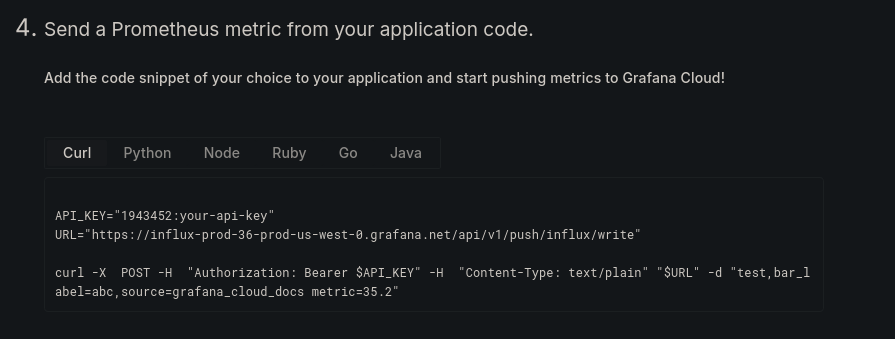

# Grafana Cloud Integration

This integration lets you send events to [Grafana Cloud](https://grafana.com/products/cloud/) for additional observability.

These events can be used for:
1. Tracking custom metrics such as workflow completion or automation successes
2. Viewing usage data in real-time
3. Monitoring chatbot performance over time, such as response latency, user drop-offs, and error rates

For an overview of Grafana HTTP APIs for metrics, check out [this blog post](https://grafana.com/blog/2024/03/21/how-to-use-http-apis-to-send-metrics-and-logs-to-grafana-cloud/).

The integration **does not add any metrics automatically**; instead, you must manually add either of the two action cards throughout your bot to record events. The two actions are:

### Send Metric

This action pre-configures event metadata to include:
* Channel (web, WhatsApp, etc.)
* BotId
* ConversationId
* UserId
* Bot Version

The only data that needs to be added to this card is a custom name for the metric. The name can be anything, as long as it does not contain any whitespace.

This card is useful for quickly recording metric-related events.

### Send Raw Data

Advanced users can define their own custom Prometheus string, minus the timestamp. For example, this records a metric called "test" with a value of 35.2 and metadata bar_label and source:

`test,bar_label=abc,source=grafana_cloud_docs metric=35.2`

**Metric names cannot contain whitespace!**

## Configuration

Three pieces of information are needed to configure this integration, all of which are available when you add an HTTP Metrics data connection to your Grafana instance here: https://<YOUR_ORG>.grafana.net/connections/add-new-connection/http-metrics

### API Key

This is a scoped API token that has write permissions on metrics, logs, and traces. It is different from the API key used to export metrics.

### User ID

This is a 7-digit number unique to your Grafana instance. You can get it from the code sample at the bottom of the 'Add connection' page.

### Endpoint URL

This is the server address where you push metrics. Make sure it starts with `influx-`. You can get it from the code sample at the bottom of the 'Add connection' page.

## Exporting Metrics

The Grafana free tier only retains metrics and logs for 14 days. You can pull your metrics data out of Grafana using the shell script in the repository root.

## About the author

This integration is created and maintained by Gordy from [Hanakano Consulting](https://www.hanakano.com). It is available [open-source on Github here](https://github.com/Gordon-BP/bp-grafana/tree/main). Pull requests are welcome!
